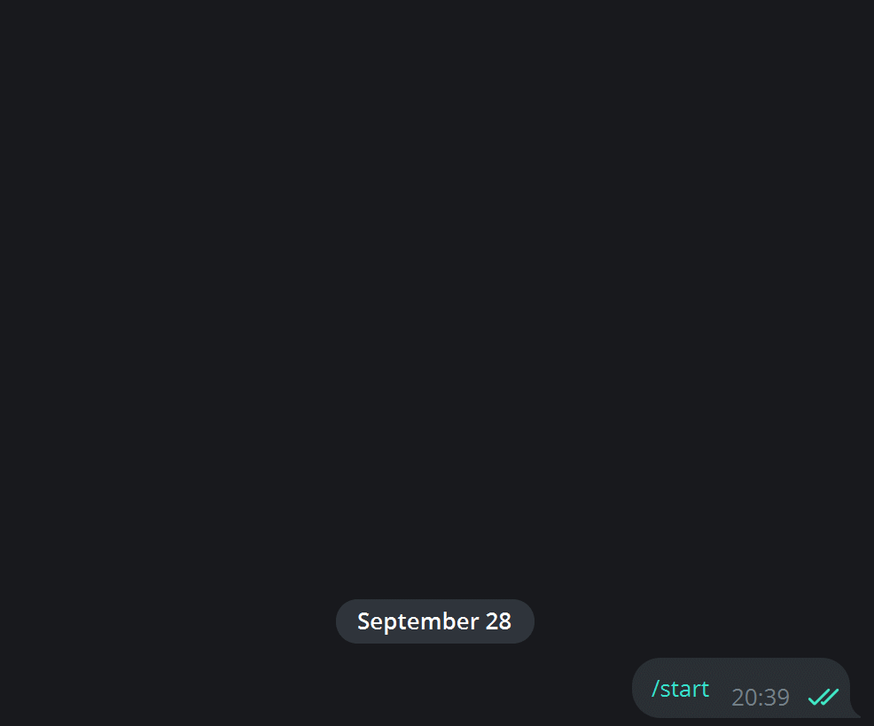

# Бот-магазин для продажи в Telegram

Telegram-бот для продажи рыбы.

Все данные хранятся в сервисе CMS Strapi

Бот сохраняет в Redis текущее состояние каждого пользователя в целях анализа воронки продаж.




### Как установить

Python 3.12 или новее должен быть уже установлен. Затем используйте `pip` (или `pip3`, если есть конфликт с Python2) для установки зависимостей:

```sh
pip install -r requirements.txt
```

Для работы бота нужен Strapi (требуется Node.js). 
В папке `my-strapi-project` скопируйте `.env.example` в `.env` и замените значения `tobemodified` на любые случайные строки. 
Затем установите зависимости и запустите Strapi из этой же папки:

```sh
npm install
npm run develop
```

В админке Strapi, расположенной по адресу `http://localhost:1337/admin`, создайте API-токен.

Также нужен Redis для хранения состояния пользователей. Сервис доступен для Linux или виртуальной машины WSL, устанавливается командами:

```sh
sudo apt install redis-server
sudo service redis-server start
```

API-ключ бота в телеграме можно получить у [@BotFather](https://t.me/BotFather).

Все переменные окружения указываются в файле `.env` в корне проекта:
```
TG_API_KEY=[API] 
STRAPI_API=[API] 
STRAPI_URL=http://localhost:1337
REDIS_HOST=localhost
REDIS_PORT=6379
```
Переменные окружения представляют собою:

- TG_API_KEY - API ключ для обращения к боту в Телеграме.
- STRAPI_API - API ключ для запросов к Strapi.
- STRAPI_URL - адрес, по которому будет запущен Strapi
- REDIS_HOST - адрес сервера Redis.
- REDIS_PORT - порт сервера Redis (6379 стандартный).


### Как использовать

Запустите Strapi и Redis, затем бота из корня проекта (папки, в которой лежит `tg_bot`):

```sh
python -m tg_bot.bot
```

### Цель проекта

Код написан в образовательных целях на онлайн-курсе для веб-разработчиков [dvmn.org](https://dvmn.org/).
